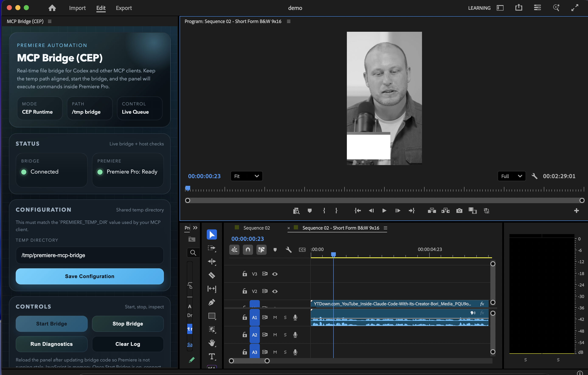

# Adobe Premiere Pro MCP Server

Control Adobe Premiere Pro with natural language through Claude using the Model Context Protocol (MCP).

<a href="https://glama.ai/mcp/servers/@hetpatel-11/Adobe_Premiere_Pro_MCP">
  
</a>

## What This Does

This MCP server lets you control Premiere Pro by talking to Claude. With **97 tools** covering project management, timeline editing, effects, transitions, audio, color correction, markers, keyframes, export, and more:

- "Add cross dissolves between all clips on track 1"
- "List all sequences and their track counts"
- "Apply Lumetri Color to the first clip"
- "Set the playhead to 30 seconds"
- "Find all clips named 'interview' in the project"
- "Export the sequence as FCP XML"

## Demo



*MCP Bridge (CEP) panel in Premiere Pro showing **Connected** and **Premiere Pro: Ready**, with Claude successfully retrieving project info via natural language.*

## Quick Start

### Prerequisites

- **macOS** (Windows support coming soon)
- **Adobe Premiere Pro** 2020 or later
- **Claude Desktop** or **Claude Code**
- **Node.js** 18+

### Installation

**1. Clone and build:**

```bash
git clone https://github.com/dpiers/Adobe_Premiere_Pro_MCP.git
cd Adobe_Premiere_Pro_MCP
npm install
npm run build
```

**2. Enable CEP extensions:**

```bash
defaults write com.adobe.CSXS.12 PlayerDebugMode 1
defaults write com.adobe.CSXS.11 PlayerDebugMode 1
defaults write com.adobe.CSXS.10 PlayerDebugMode 1
```

**3. Install the CEP plugin:**

```bash
mkdir -p ~/Library/Application\ Support/Adobe/CEP/extensions
cp -r cep-plugin ~/Library/Application\ Support/Adobe/CEP/extensions/MCPBridgeCEP
```

**4. Add MCP server config:**

For **Claude Desktop**, edit `~/Library/Application Support/Claude/claude_desktop_config.json`:

```json
{
  "mcpServers": {
    "premiere-pro": {
      "command": "node",
      "args": ["/path/to/Adobe_Premiere_Pro_MCP/dist/index.js"],
      "env": {
        "PREMIERE_TEMP_DIR": "/tmp/premiere-mcp-bridge"
      }
    }
  }
}
```

For **Claude Code**, add to `~/.claude/settings.json` or your project's `.mcp.json`.

**5. Restart Claude and Premiere Pro**, then open the CEP panel:

1. **Window > Extensions > MCP Bridge (CEP)**
2. Set **Temp Directory** to `/tmp/premiere-mcp-bridge`
3. Click **Save Configuration**, then **Start Bridge**

**6. Test:** Ask Claude *"What's my current Premiere Pro project info?"*

## How It Works

```
+-----------+        +-----------+        +-----------+
|  Claude   |  MCP   | Node.js   | Files  | CEP Plugin|
|  Desktop  |<------>| MCP Server|<------>| (Premiere)|
+-----------+        +-----------+        +-----------+
                                                 |
                                                 v
                                          +-----------+
                                          | Premiere  |
                                          | ExtendScript
                                          +-----------+
```

1. Claude calls an MCP tool (e.g. `batch_add_transitions`)
2. MCP server generates an ExtendScript with helper functions prepended
3. Script is written to a command file in the temp directory
4. CEP plugin polls for command files, wraps in IIFE, executes via `CSInterface.evalScript()`
5. Result is written to a response file, returned to Claude

### ExtendScript Helpers

Every script gets these helpers auto-prepended by the bridge:

- `__findSequence(id)` - Find sequence by ID (replaces non-existent `getSequenceByID`)
- `__findClip(nodeId)` - Find clip across all tracks with track/index info
- `__findProjectItem(nodeId)` - Recursive project item lookup
- `__ticksToSeconds(ticks)` / `__secondsToTicks(seconds)` - Time conversion

### QE DOM

Tools that need the QE DOM (effects, transitions, razor/split) call `app.enableQE()` and use `qe.project` for operations not available in the standard DOM.

## Available Tools (97)

### Discovery & Project Info
| Tool | Description |
|------|-------------|
| `list_project_items` | List all media items, bins, and assets |
| `list_sequences` | List all sequences with properties |
| `list_sequence_tracks` | List tracks and clips in a sequence |
| `get_project_info` | Get project name, path, status |
| `find_project_item_by_name` | Search for items by name |
| `get_active_sequence` | Get the currently active sequence |
| `get_clip_properties` | Get detailed clip properties |
| `get_clip_at_position` | Find clip at a specific time on a track |
| `get_selected_clips` | Get currently selected clips |
| `get_sequence_settings` | Get sequence resolution, framerate, etc. |

### Project Management
| Tool | Description |
|------|-------------|
| `create_project` | Create a new project |
| `open_project` | Open an existing project |
| `save_project` | Save the current project |
| `save_project_as` | Save with a new name/location |
| `set_active_sequence` | Switch the active sequence |
| `consolidate_duplicates` | Clean up duplicate media |
| `undo` | Programmatic undo |

### Media Management
| Tool | Description |
|------|-------------|
| `import_media` | Import a media file |
| `import_folder` | Import all files from a folder |
| `create_bin` | Create a bin (folder) |
| `move_item_to_bin` | Move items between bins |
| `relink_media` | Relink offline media to new path |
| `refresh_media` | Force-refresh media from disk |
| `check_offline_media` | Scan for offline/missing media |
| `import_sequences_from_project` | Import sequences from another project |

### Sequence Management
| Tool | Description |
|------|-------------|
| `create_sequence` | Create a new sequence |
| `duplicate_sequence` | Clone a sequence |
| `delete_sequence` | Delete a sequence |
| `set_sequence_settings` | Update sequence settings |
| `create_subsequence` | Create subsequence from current state |
| `auto_reframe_sequence` | AI-powered reframe to new aspect ratio |

### Timeline Operations
| Tool | Description |
|------|-------------|
| `add_to_timeline` | Add a clip to the timeline |
| `remove_from_timeline` | Remove a clip (ripple or lift) |
| `move_clip` | Move a clip to a new position |
| `trim_clip` | Adjust in/out points |
| `split_clip` | Split a clip at a time point (QE razor) |
| `duplicate_clip` | Duplicate a clip on the timeline |
| `replace_clip` | Replace a clip with different media |
| `enable_disable_clip` | Enable or disable a clip |
| `reverse_clip` | Reverse clip playback |
| `link_audio_video` | Link/unlink A/V components |
| `set_clip_properties` | Set opacity, scale, rotation |

### Effects & Color (QE DOM)
| Tool | Description |
|------|-------------|
| `apply_effect` | Apply a video or audio effect |
| `remove_effect` | Check if effect exists (removal unsupported) |
| `apply_audio_effect` | Apply an audio effect |
| `list_available_effects` | List all installed video effects |
| `list_available_audio_effects` | List all installed audio effects |
| `color_correct` | Apply Lumetri Color with adjustments |
| `apply_lut` | Apply a LUT file for color grading |
| `stabilize_clip` | Apply Warp Stabilizer |
| `speed_change` | Change clip playback speed |

### Transitions (QE DOM)
| Tool | Description |
|------|-------------|
| `add_transition` | Add transition between two clips |
| `add_transition_to_clip` | Add transition to clip start or end |
| `batch_add_transitions` | Add transitions to ALL clips on a track |
| `list_available_transitions` | List all installed video transitions |
| `list_available_audio_transitions` | List all installed audio transitions |

### Audio
| Tool | Description |
|------|-------------|
| `adjust_audio_levels` | Set clip volume |
| `add_audio_keyframes` | Add volume keyframes |
| `mute_track` | Mute/unmute an audio track |

### Keyframes
| Tool | Description |
|------|-------------|
| `add_keyframe` | Add a keyframe to any component parameter |
| `remove_keyframe` | Remove a keyframe |
| `get_keyframes` | List all keyframes for a parameter |

### Text & Graphics
| Tool | Description |
|------|-------------|
| `add_text_overlay` | Add text via MOGRT template |
| `import_mogrt` | Import a Motion Graphics Template |
| `import_mogrt_from_library` | Import MOGRT from CC Libraries |

### Markers
| Tool | Description |
|------|-------------|
| `add_marker` | Add a marker to the timeline |
| `delete_marker` | Delete a marker |
| `update_marker` | Update marker properties |
| `list_markers` | List all markers in a sequence |

### Track Management
| Tool | Description |
|------|-------------|
| `add_track` | Add a video or audio track |
| `delete_track` | Delete a track |
| `lock_track` | Lock/unlock a track |
| `toggle_track_visibility` | Show/hide a video track |

### Playhead & Work Area
| Tool | Description |
|------|-------------|
| `get_playhead_position` | Get current playhead position |
| `set_playhead_position` | Move the playhead |
| `set_work_area` | Set work area in/out points |
| `get_work_area` | Get work area bounds |
| `set_sequence_in_out_points` | Set sequence in/out points |
| `get_sequence_in_out_points` | Get sequence in/out points |

### Metadata & Labels
| Tool | Description |
|------|-------------|
| `get_metadata` | Get project and XMP metadata |
| `set_metadata` | Set project metadata |
| `set_color_label` | Set color label (0-15) |
| `get_color_label` | Get color label |
| `get_footage_interpretation` | Get footage interpretation settings |
| `set_footage_interpretation` | Set frame rate, pixel aspect ratio |

### Export & Interchange
| Tool | Description |
|------|-------------|
| `export_sequence` | Export/render a sequence |
| `export_frame` | Export a single frame as image |
| `export_as_fcp_xml` | Export as Final Cut Pro XML |
| `export_aaf` | Export AAF for Pro Tools |
| `add_to_render_queue` | Add to Media Encoder queue |
| `get_render_queue_status` | Check render queue status |

### Advanced
| Tool | Description |
|------|-------------|
| `detect_scene_edits` | Detect scene changes in clips |
| `create_caption_track` | Create captions from SRT file |
| `create_subclip` | Create subclip with in/out points |
| `create_nested_sequence` | Nest clips into a sequence |
| `unnest_sequence` | Break apart a nested sequence |
| `manage_proxies` | Check/attach/get proxy media |

## Troubleshooting

### CEP Plugin doesn't appear

```bash
# Verify PlayerDebugMode
defaults read com.adobe.CSXS.12 PlayerDebugMode  # Should return: 1

# Verify plugin is installed
ls ~/Library/Application\ Support/Adobe/CEP/extensions/MCPBridgeCEP/
```

Then restart Premiere Pro completely.

### Commands timeout

1. CEP panel should show "Connected" - click **Start Bridge** if not
2. Verify temp directory paths match in both CEP panel and MCP config
3. Make sure a project is open in Premiere Pro

### Claude can't see tools

Restart Claude Desktop/Code completely and verify the config path to `dist/index.js` is correct.

## Technical Details

### Why CEP instead of UXP?

CEP has full ExtendScript support in Premiere Pro. UXP support is limited and doesn't provide ExtendScript execution. CEP works on Premiere Pro 2020-2025.

### ExtendScript Compatibility

ExtendScript is ES3 (JavaScript 1.5), so all generated scripts use `var`, manual loops, and no modern syntax. The bridge prepends helper functions to every script for sequence/clip/item lookup.

### Security

- Scripts validated before execution (no `eval`, `require`, `import`, etc.)
- 500KB script size limit
- Temp directory restricted to owner (mode 700)

## License

MIT License - See LICENSE.md

## Contributing

Contributions welcome! Please fork, create a feature branch, test with Premiere Pro, and submit a pull request.

---

**Built with the Model Context Protocol** | [Claude Desktop](https://claude.ai/download) | [MCP Documentation](https://modelcontextprotocol.io)
