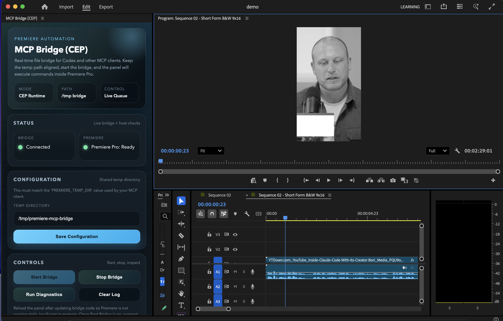
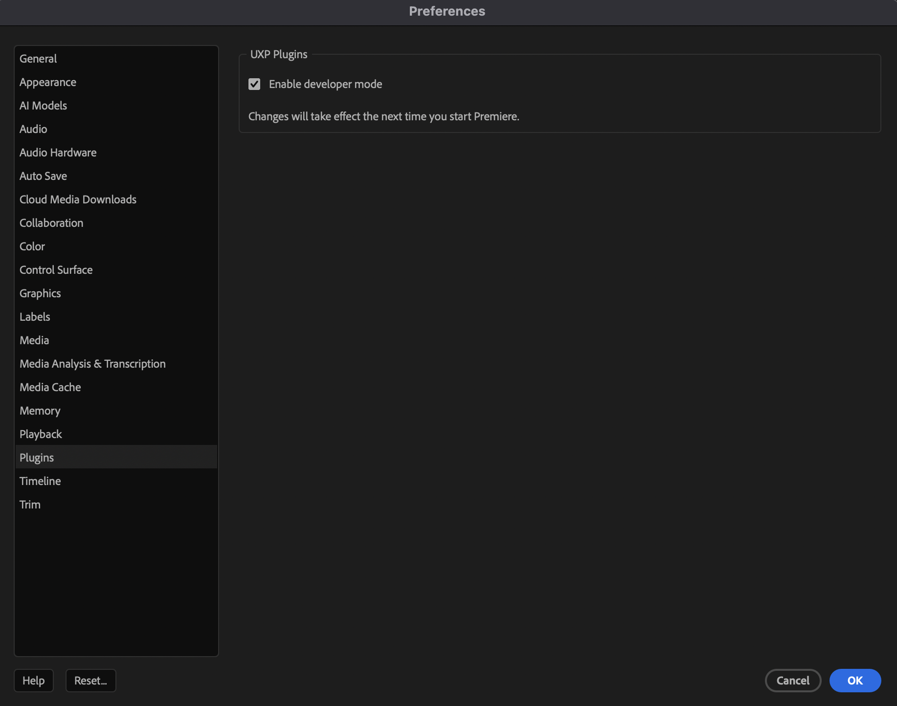

# Adobe Premiere Pro MCP Server

English | [日本語](README.ja.md) | [Tiếng Việt](README.vi.md) | [简体中文](README.zh-CN.md) | [繁體中文](README.zh-TW.md) | [한국어](README.ko.md) | [Deutsch](README.de.md) | [Español](README.es.md) | [Français](README.fr.md) | [Italiano](README.it.md) | [Dansk](README.da.md) | [Polski](README.pl.md) | [Русский](README.ru.md) | [Bosanski](README.bs.md) | [العربية](README.ar.md) | [Norsk](README.no.md) | [Português (Brasil)](README.pt-BR.md) | [ไทย](README.th.md) | [Türkçe](README.tr.md) | [ភាសាខ្មែរ](README.km.md)

Control Adobe Premiere Pro through MCP using Codex, Claude Code, Claude Desktop, or any other MCP client.

---

## Building Something Better

<table>
<tr>
<td width="100" align="center">
<a href="https://github.com/Monet-AI-Editor/Monet">
  
</a>
</td>
<td>

**Adobe Premiere Pro was not built for AI agents — and it shows.**

I'm building **[Monet](https://github.com/Monet-AI-Editor/Monet)**, an AI-first video editor designed from day one for full coding-agent control for claude code and openai codex. No workarounds. No scripting hacks. Just a clean API built for the way agents actually work.

➡️ **[Star Monet on GitHub](https://github.com/Monet-AI-Editor/Monet)** 

</td>
</tr>
</table>

---



Current CEP panel UI inside Premiere Pro, using the refreshed bridge controls and status layout.

## Current Status

This repository is currently validated for:

- macOS
- Adobe Premiere Pro 2020+ (actively used and tested on Premiere Pro 26.0)
- Node.js 18+
- the included macOS installer path for Claude Desktop
- manual MCP registration for Codex, Claude Code, and similar MCP clients

Current catalog status as of July 29, 2026:

- `281` Premiere Pro MCP tools are exposed for AI-driven video editing
- coverage spans project setup, media ingest, bins, sequences, timeline editing, transitions, effects, keyframes, captions, markers, metadata, proxies, multicam, color, audio, exports, and higher-level assembly workflows
- the catalog includes practical agent workflows such as product-spot assembly, motion-graphics demos, timeline razoring, caption reads, audio ducking, scene edit detection, EDL import, export readiness validation, and linked audio/video operations

Most recent completed local live validation:

- `281` active tools are exposed; `validate_project_for_export` replaces the removed AE comp import path with a non-destructive export readiness audit, and the merged main branch includes `detect_silence`
- `0` known parked or placeholder tools are advertised
- `import_ae_comps` is intentionally not advertised because Premiere returned `false` for real `.aep` fixtures in this environment and a generic `.aep` import can wedge the CEP bridge

The full live sweep output is written to `/tmp/premiere-mcp-bridge/live-tool-sweep.json` when you run the verifier.

## What You Get

The server covers project operations, ingest, sequence creation, timeline editing, transitions, effects, keyframes, metadata, exports, and higher-level assembly workflows.

Example prompts:

- "List all sequences and show me which one is active."
- "Import these three shots and build a rough product spot."
- "Add cross dissolves to every cut on video track 1."
- "Apply Gaussian Blur to the middle clip."
- "Apply the `Black & White` effect to the active short-form clip."
- "Razor the interview sequence at 12.5 seconds across all audio and video tracks."
- "Export the active sequence as FCP XML."

For monochrome looks, prefer `apply_effect` with `Black & White` instead of trying to force black and white through generic saturation-only adjustments.

Before editing, you can also attach the `premiere://config/get_instructions` resource to give the model Premiere-specific operating guidance.

High-level workflow tools included:

- `build_motion_graphics_demo`
- `assemble_product_spot`
- `build_brand_spot_from_mogrt_and_assets`

`assemble_product_spot` and `build_brand_spot_from_mogrt_and_assets` now support an optional `clipPlan` argument so an LLM can direct per-clip timing, track placement, transitions, motion, trims, effects, and color adjustments instead of relying on fixed template defaults.

## Agent Skill

If you want Codex, Claude Code, or another agent to handle installation, verification, and day-to-day usage correctly, install the included Agent Skill:

```bash
npx skills add hetpatel-11/Adobe_Premiere_Pro_MCP --skill premiere-pro-mcp
```

Or install directly from the skill path:

```bash
npx skills add https://github.com/hetpatel-11/Adobe_Premiere_Pro_MCP/tree/main/skills/premiere-pro-mcp
```

The skill teaches agents how to install the MCP, start and verify the CEP bridge, use the Premiere tools safely, import real media before editing, prefer sequence-aware operations, and run diagnostics when something fails.

## Fastest Install

### Windows with VS Code and GitHub Copilot

```powershell
git clone https://github.com/hetpatel-11/Adobe_Premiere_Pro_MCP.git
cd Adobe_Premiere_Pro_MCP
npm run setup:win
```

The Windows installer builds the server, installs the CEP extension, enables CEP debug mode, creates the bridge temp directory, and adds `premiere-pro` to the VS Code user MCP configuration used by GitHub Copilot. It does not require Claude and does not create or modify Claude configuration.

### macOS with Claude Desktop

```bash
git clone https://github.com/hetpatel-11/Adobe_Premiere_Pro_MCP.git
cd Adobe_Premiere_Pro_MCP
npm run setup:mac
```

That installer will:

- install dependencies
- build `dist/index.js`
- enable Adobe CEP debug mode
- install the `MCP Bridge (CEP)` extension
- create `/tmp/premiere-mcp-bridge`
- add the `premiere-pro` MCP entry to Claude Desktop

Important:

- the supported UI bridge in this repo is the `MCP Bridge (CEP)` extension
- the installer enables Adobe **CEP** debug mode automatically
- if Premiere does not expose the extension cleanly on your machine, enable **UXP Plugins > Enable developer mode** in Premiere Pro preferences before opening the bridge panel
- `npm run setup:mac` is the easiest path for Claude Desktop on macOS because it updates Claude Desktop config automatically

After the installer finishes:

1. Quit and reopen your MCP client if it reads config on startup. If you used the installer, that means Claude Desktop.
2. Quit and reopen Premiere Pro.
3. In Premiere Pro on macOS, open `Premiere Pro > Preferences > Plugins` and enable **UXP Plugins > Enable developer mode**.
4. Restart Premiere Pro if the setting was changed.
5. Open `Window > Extensions > MCP Bridge (CEP)`.
6. Set `Temp Directory` to `/tmp/premiere-mcp-bridge`.
7. Click `Save Configuration`.
8. Click `Start Bridge`.
9. Connect from Codex, Claude Code, Claude Desktop, or another MCP client using the same temp directory.
10. If commands fail, click `Run Diagnostics` and send back `/tmp/premiere-mcp-bridge/premiere-mcp-diagnostics-latest.json`.

If you need a visual reference for the developer mode toggle, it looks like this:



If the panel reports that Premiere is ready after `Start Bridge`, the bridge is live.

## Install By Client

### VS Code and GitHub Copilot on Windows

Run:

```powershell
npm run setup:win
```

The installer writes the `premiere-pro` server entry to `%APPDATA%\Code\User\mcp.json` while preserving other configured servers. After installation, restart VS Code and run `MCP: List Servers` from the Command Palette to confirm that `premiere-pro` is running.

The bridge directory shown in the Premiere CEP panel must match `%TEMP%\premiere-mcp-bridge`.

### Claude Desktop

On macOS, use:

```bash
npm run setup:mac
```

That is the only path in this repo that automatically writes the MCP entry for you.

### Codex

Build the server first:

```bash
npm install
npm run build
```

Then add the MCP server on a single line:

```bash
codex mcp add premiere_pro --env PREMIERE_TEMP_DIR=/tmp/premiere-mcp-bridge -- node /absolute/path/to/Adobe_Premiere_Pro_MCP/dist/index.js
```

### Claude Code

Build the server the same way:

```bash
npm install
npm run build
```

Then register the MCP server in Claude Code using the same built `dist/index.js` entrypoint and the same temp directory:

```text
command: node /absolute/path/to/Adobe_Premiere_Pro_MCP/dist/index.js
env: PREMIERE_TEMP_DIR=/tmp/premiere-mcp-bridge
```

If you use a local MCP config file instead of a helper command, point it at the same `dist/index.js` and set the same env var.

### Other MCP Clients

Use the same manual registration approach as Claude Code:

```text
command: node /absolute/path/to/Adobe_Premiere_Pro_MCP/dist/index.js
env: PREMIERE_TEMP_DIR=/tmp/premiere-mcp-bridge
```

Important for all manual client setups:

- keep the command on one line
- use the real absolute path to `dist/index.js`
- restart the client after adding or updating the MCP entry
- start the CEP bridge inside Premiere and confirm the temp directory is exactly `/tmp/premiere-mcp-bridge`

## Verify the Install

Run the built-in checks:

```bash
npm run setup:doctor
```

That validates:

- Node.js version
- built server output
- CEP extension install
- `/tmp/premiere-mcp-bridge`
- Adobe CEP debug mode
- the Claude Desktop config entry when you use the installer path
- CEP panel diagnostics written to `/tmp/premiere-mcp-bridge/premiere-mcp-diagnostics-latest.json`

For a deeper end-to-end check, use a disposable Premiere project and run:

```bash
node scripts/live-tool-sweep.mjs
```

This creates temporary `Sweep ...` sequences in the currently open project so the toolchain is exercised against real data.

## How the Bridge Works

```text
+-----------+        +-----------+        +-----------+
|  Client   |  MCP   | Node.js   | Files  | CEP Panel |
| (Codex+)  |<------>| MCP Server|<------>| (Premiere)|
+-----------+        +-----------+        +-----------+
                                                 |
                                                 v
                                          +-----------+
                                          | Premiere  |
                                          | DOM / QE  |
                                          +-----------+
```

1. The client calls an MCP tool.
2. The Node server generates ExtendScript plus shared helpers.
3. The script is written into `/tmp/premiere-mcp-bridge`.
4. The CEP panel polls that directory and runs the script through `CSInterface.evalScript()`.
5. The panel writes the result back to the response file.
6. The server returns structured JSON to the MCP client.

## Tool Coverage

The `281` exposed tools are grouped roughly like this:

- Discovery and project inspection
- Project and sequence management
- Media import and bin management
- Timeline placement and clip operations
- Effects, transitions, color, and keyframes
- Markers, metadata, labels, and work-area control
- Export and interchange helpers
- MOGRT, captions, proxies, and relink helpers
- High-level ad / promo assembly workflows

Use MCP introspection in your client to see the full tool catalog and exact schemas.

## Real Limits

This project is much more usable than the original prototype, but it is not magic.

- Premiere scripting still does not expose every UI operation cleanly.
- Professional title design still depends on real MOGRT assets or external graphics workflows.
- `get_render_queue_status` is only useful when Adobe Media Encoder integration is available.
- The best results come from real source footage, real audio, and real brand assets. The automation layer assembles and manipulates them; it does not replace editorial judgment.

## Troubleshooting

If the tools are visible but calls fail:

1. Confirm Premiere Pro is open with a project loaded.
2. Open `Window > Extensions > MCP Bridge (CEP)`.
3. Confirm the temp directory is exactly `/tmp/premiere-mcp-bridge`.
4. Click `Start Bridge`.
5. If you updated the bridge code, right-click the panel and choose `Reload`.
6. Retry the command.

If the MCP client cannot find the server:

1. Verify the absolute path to `dist/index.js`.
2. Verify `PREMIERE_TEMP_DIR=/tmp/premiere-mcp-bridge`.
3. Restart the MCP client after changing config.
4. Run `npm run setup:doctor`.

## Developer Notes

Useful commands:

```bash
npm run build
npm test -- --runInBand
npm run setup:doctor
node scripts/live-tool-sweep.mjs
```

See:

- `QUICKSTART.md` for the shortest install path
- `KNOWN_ISSUES.md` for current limits
- `CONTRIBUTING.md` for development workflow
